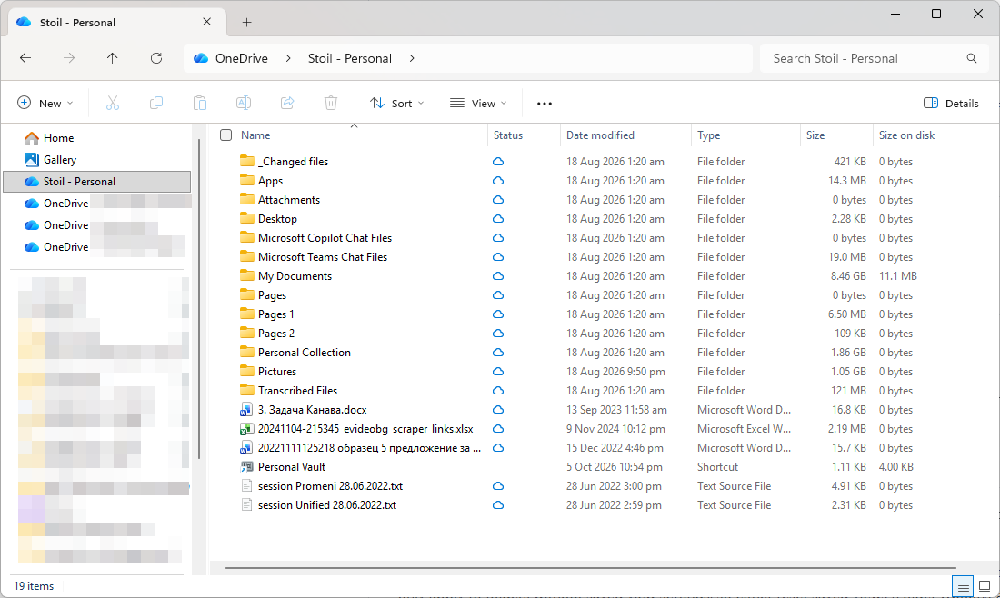
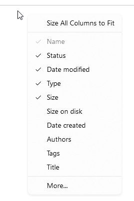
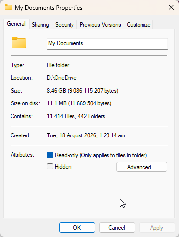

# Size on disk column in Explorer details

A [Windhawk](https://windhawk.net/) mod that adds a **Size on disk** column to File Explorer's details view, for files and folders. The values match the "Size on disk" figure in each item's Properties dialog.

## Requirements

- Windows 11 24H2 or later (x64)
- Windhawk

## Installation

Once the mod is accepted into the Windhawk catalogue, install it from Windhawk's **Explore** tab by searching for "Size on disk".

To install it manually, open Windhawk, choose **Create a new mod**, replace the template with the contents of [`explorer-size-on-disk-column.wh.cpp`](explorer-size-on-disk-column.wh.cpp), then click **Compile** and **Enable**.

## Usage

Open a folder in **Details** view, right-click any column header and tick **Size on disk**. If it isn't in the short list, click **More...** and find it there.

The values match the Properties dialog:

With **Add to default folder layouts** enabled, the column is added to Explorer's built-in folder templates. Templates only apply to folders without saved view settings, so either reset saved views (Folder Options > View > **Reset Folders**) or set the column up in one folder and use Folder Options > View > **Apply to Folders**.

## Settings

| Setting | Default | What it does |
|---|---|---|
| Show folder sizes | Enabled | Calculate folder sizes always, only while Shift is held, or never (files only). |
| Folder calculation method | Accurate | Accurate matches the Properties dialog. Fast reads directory listings, which is quicker but can be off for very small files and cloud files. |
| Calculate sizes on network drives | Off | Network files and folders can be slow to query, and Explorer may stop responding while it waits. When off, the column stays empty on network drives. |
| Mix files and folders when sorting | Off | By default, folders stay together when sorting by size on disk. |
| Add to default folder layouts | On | Adds the column after Size in Explorer's folder templates. |
| Folder refresh interval (seconds) | 120 | Cached values are shown straight away; older folder values are recalculated in the background. |

## How it works

Windows already defines a hidden `System.FileAllocationSize` property, but Explorer doesn't offer it as a column, and its own getter (`CFSFolder::_GetFileAllocationSize`) returns the logical size. The mod exposes the property as a column and replaces that getter with a real size on disk calculation:

- **Files:** the allocation size rounded down to whole clusters, so tiny files stored inside the NTFS file table count as 0 bytes, as in Properties. Compressed, sparse and CompactOS files use their compressed size rounded up to whole clusters.
- **Folders:** the sum of every file underneath, calculated in the background at low priority and never on Explorer's window threads. Junctions and symbolic links aren't followed. OneDrive and other cloud folders are walked, except those whose contents aren't on the PC yet, which count as 0 bytes without being listed.
- **Cache:** values are shown immediately from the cache and refreshed in the background. Calculating a folder also caches all of its subfolders.

## Limitations

- Libraries, search results, zip folders and the Recycle Bin don't show values, as they aren't regular file system folders.
- Hard links are counted once per link, as the Properties dialog does.
- The column is never added to the Home page or Gallery layouts.
- A Windows update that renames the Explorer functions the mod hooks will stop the mod from loading until it's updated. Explorer itself keeps working.

## If Explorer windows stop opening

1. Press **Ctrl+Shift+Esc** to open Task Manager.
2. Use **Run new task** to start Windhawk and disable the mod.
3. On the **Details** tab, end every `explorer.exe`, then use **Run new task** with `explorer.exe`.

## Development history

Each version is a separate commit, with test results in the commit message.

| Version | Summary |
|---|---|
| 0.1 | First prototype: column appeared, but values matched Size. |
| 0.2 | Diagnostics found Explorer's own allocation size getter; default column layouts added. |
| 0.3 | Replaced that getter; folder calculations moved off window threads. |
| 0.4 | Fixed Explorer windows not opening (Home page layout) and OneDrive folder totals. |
| 0.5 | Faster sizes, instant cached values, small-file fix and lower disk and OneDrive load. |
| 0.6 | Fixes from the Windhawk review: private thread pool for folder walks, safe unloading, links and cloud folders handled consistently, network drives skipped entirely by default. |

## Credits

The mod's structure and its windows.storage.dll symbol hooks are based on [Better file sizes in Explorer details](https://windhawk.net/mods/explorer-details-better-file-sizes) by [m417z](https://github.com/m417z). Developed with AI assistance (Claude).

## Licence

[GNU General Public License v3.0](LICENSE)
